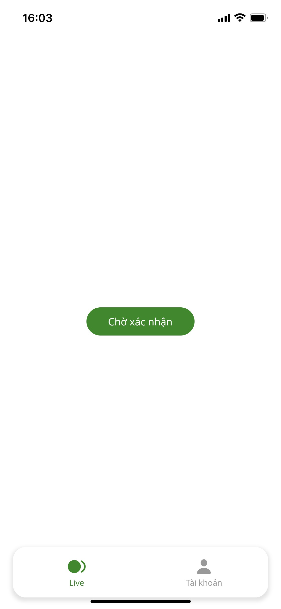

# Tài liệu Hita Livestream

Các chức năng đã làm

- Mobile: Đăng ký, đăng nhập, cập nhật thông tin xác thực + up hình, hiển thị màn hình camera livestream, push notification
- Web admin: Đăng nhập, danh sách các tài khoản chờ xác thực, từ chối , duyệt yêu cầu xác thực, nhận notification
- Backend: Cung cấp các API cho mobile và web

Các chức năng chưa làm
- Chức năng livestream

# Hướng dẫn sử dụng chạy demo

#### Mobile
Mobile cũng được build thành APK đối với Android và upload lên TestFight đối với iOS
- Đối với Android: link file APK https://drive.google.com/drive/folders/1rfRgI2bvA984q1aRbvdSTa2R2IUT2uZD?usp=sharing (do không up lên store nên không build dưới dạng *.abb nên khi test vui lòng tải xuống file APK phù hợp với kiến trúc của máy test)
- Đối với iOS: Link public testing TestFight (nếu chưa có TestFight thì vào AppStore download TestFight và bấm vào link mời)
- Một tài khoản đã được xác thực: van@test.com/12345678

#### Web admin
Vào thư mục web-admin và chạy lệnh **ng serve** để khởi chạy dự án Angular, sau đó mở Web truy cập vào đường dẫn **http://localhost:4200**
Thông tin đăng nhập của admin đã được tự động điền sẵn (admin@test.com/12345678) sau đó bấm đăng nhập

#### Backend
Backend đã được deploy lên heroku (link API: https://hita-live.herokuapp.com)
Database và S3 đã được cấu hình online
URL API đã được cấu hình cho source mobile và web

###### Chú ý: do không có nhiều thời gian nên việc xử lý realtime phụ thuộc hoàn toàn vào Firebase, nên bắt buộc phải cho phép nhận thông báo từ WEB và Mobile, nếu không nhận được thông báo vui lòng reload lại ứng dụng Web và tắt app mở lại để tải dữ liệu mới.

# Thông tin clip demo quay sẵn
- Mô tả toàn bộ flow app trên Android: https://drive.google.com/drive/folders/1rogbz1ElF_9WVToLd2_xA5QuXFEmcTPV?usp=sharing
- Mô tả chạy ứng dụng iOS từ TestFight: https://drive.google.com/drive/folders/1iteY41t3fKhgUhwecymzzyjACmmFy6Su?usp=sharing

## Giới thiệu chi tiết
## Mobile

Sử dụng Flutter xây dựng ứng dụng mobile cho android và ios
Cấu hình Firebase Cloud Message để nhận thông báo trên ứng dụng cho Android và iOS, cấu hình APNs cho iOS
Build apk và deploy ứng dụng iOS lên TestFight

Sử dụng flutter_bloc phục vụ cho việc quản lý state trên toàn bộ app, đảm bảo các nguyên tắc giao tiếp giữa càng tầng với nhau


Các thư viện chính:
| Plugin | Mô tả |
| ------ | ------ |
| flutter_bloc | quản lý state cho ứng dụng |
| image_picker | gọi máy ảnh chụp hình |
| video_stream | gọi camera phục vụ cho việc livestream |
| nhóm thư viện firebase | nhận thông báo từ firebase |
| flutter_secure_storage | lưu lại token đăng nhập|
| dio | tương tác với API |
| flutter_rounded_date_picker | dialog lựa chọn ngày |

Cấu trúc source
```
----assets (thư mục chứa các file hình ảnh)
----lib
    |---app (chứa các file cấu hình khởi tạo khi ứng dụng được khởi chạy)
    |---blocs (quản lý state trên toàn bộ ứng dụng)
    |---common (chứa các widget thường được dùng chung)
    |---config (chứa các file config, các biến môi trường của hệ thống)
    |---dto (data transfer object - thư mục thể hiện cho body khi gọi API)
    |---enums (chứa toàn bộ enum hệ thống)
    |---http (cấu hình phần dùng chung cho khi tương tác với API)
    |---model (chứa các class thể hiện cho các đối tượng ở phía app)
    |---providers (các class phục vụ cho việc giao tiếp trực tiếp với API)
    |---repositories (các class phục vụ cho việc giao tiếp giữa provider và bloc)
    |---ro (response object - thư mục thể hiện cho response trả về từ API)
    |---screens (chứa các màn hình của ứng dụng)
    |---utilities (chứa các file tiện ích như date helper, form helper...)
    |---main.dart
```

### Hình ảnh giao diện
Màn hình login


Màn hình đăng ký


Màn hình chính có 2 bottom tab là Live và Tài khoản, tài khoản phải được xác thực thì khi bấm vào nút 'Live ngay' mới có thể di chuyển đến màn hình Livestream, còn không sẽ di chuyển đến màn hinh 'Nhập thông tin xác thực', khi đang chờ duyệt sẽ hiện thị 'Chờ xác nhận'




Màn hình Livestream


Màn hình nhập thông tin xác thực

## Web-admin

Sử dụng Angular xây dựng ứng dụng web-admin
Cấu hình Firebase Cloud Message để nhận thông báo trên web
Sử dụng thư viện Ant Design of Angular chứa các component có sẵn để tiện xây dựng giao diện cho ứng dụng.

### Hình ảnh giao diện
Màn hình đăng nhập với thông tin đăng nhập được điền sẵn


Màn hình danh sách chờ duyệt các thông tin xác thực của người dùng gửi lên, khi rê chuột vào hình ảnh có thể xem hình ành ở dạng to hơn

## Backend

Sử dụng Nestjs và MySQL xây dựng backend và cơ sở dữ liệu cho hệ thống
Cấu hình Firebase Admin để xử lý gửi thông báo từ Backend
Sử dụng AWS EC2 có cấu hình MySQLServer phục vụ việc chứa Database MySQL
Sử dụng AWS S3 để upload hình ảnh xác thực từ ứng dụng mobile

Thông tin bảng User và một số field quan trọng:
- role: 0 là user và 1 là admin
- verify_status: tượng trưng cho trạng thái xác thực của tài khoản và có 4 trạng thái: 0(ban đầu), 1(đang gửi yêu cầu), 2(duyệt), 3(từ chối)
- push_token: lưu lại thông tin Firebase token tương ứng với từng thiết bị phục vụ cho việc gửi thông báo
- image: lưu trữ đường dẫn hình được lưu ở S3


Danh sách API:
| Tên API | Phương thức |Mô tả|Nơi sử dụng|
| ------ | ------ | ------ | ------ |
| auth/login | POST | đăng nhập | mobile, web |
| auth/register | POST | đăng ký người dùng mới | mobile |
| user/user-info | GET | lấy thông tin người dùng đang đăng nhập| mobile |
| user/add-verify-info | PUT | cập nhật thông tin và gửi thông báo đến cho admin | mobile |
| user/update-push-token | PUT | cập nhật thông tin firebase token tương ứng với từng tài khoản | mobile, web |
| user/pending-verify| GET | danh sách các thông tin xác thực chờ duyệt | web |
| user/rejected | PUT | từ chối thông tin xác thực và gửi thông báo đến người dùng| web |
| user/approved | PUT | duyệt thông tin xác thực và gửi thông báo đến người dùng| web |

